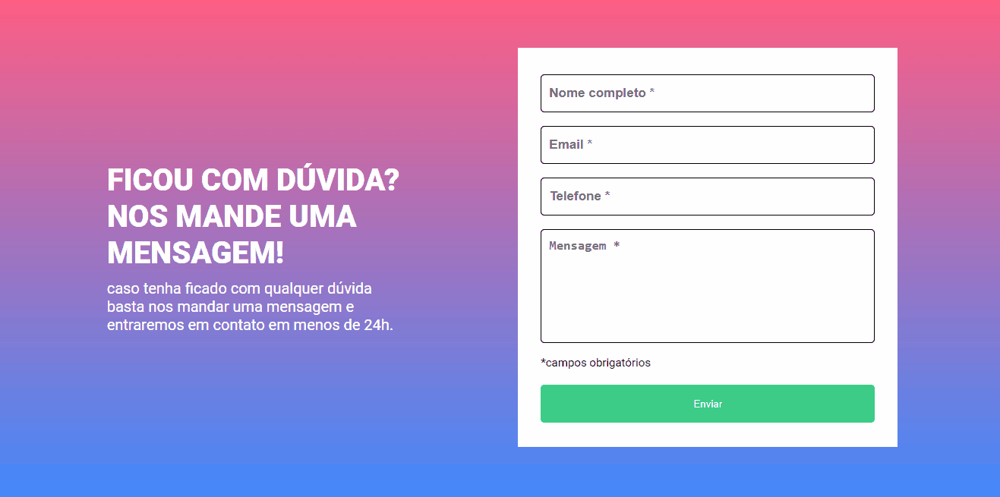

# Formulário com Validação

Um site simples com um pequeno formulário e um botão de enviar, que quando pressionado valida se os campos estão preenchidos ou não ✅❌.

[]

## Linguagens utilizadas

- HTML

- CSS

- JavaScript

## Desafios

O maior desafio/dificuldade que tive neste projeto foi relacionado a função de validação, que a princípio, não estava conseguindo fazer com que a lógica funcionasse, mas depois de estudar e pesquisar um pouco, finalizei o projeto e com o código totalmente funcional.